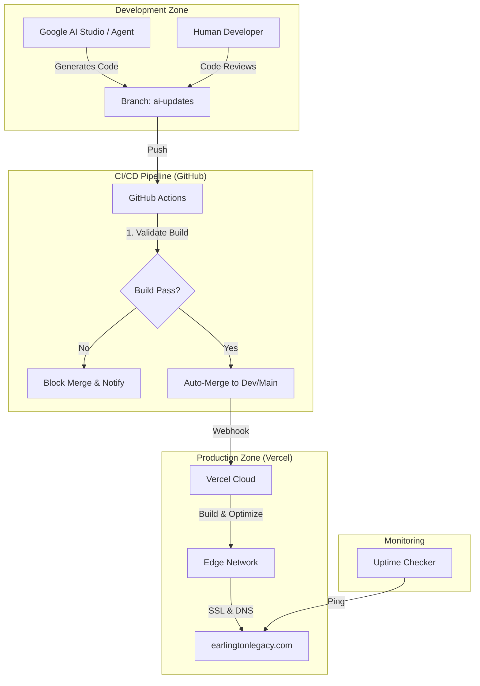

# Earlington Legacy: Fully Automated System Setup

## Google AI Studio -> GitHub -> Vercel -> Afrihost

This document serves as the master guide for the Zero-Cost Automated Infrastructure.

---

### **A. System Architecture**

The system is designed as a closed-loop autonomous pipeline.



---

### **B. Implementation Checklist**

#### 1. Repository & CI/CD

- [x] **Pipeline Workflow**: Created `.github/workflows/ai-pipeline.yml`.
- [x] **Uptime Monitoring**: Created `.github/workflows/uptime.yml`.
- [x] **Clean Up**: Removed legacy workflows (`ai-merge.yml`, `ci.yml`).

#### 2. Vercel Configuration

- [x] **Config File**: Optimized `vercel.json` created.
- [ ] **Action**: Go to Vercel Dashboard -> Settings -> Git. Ensure "Production Branch" is `main`.
- [ ] **Action**: Go to Vercel Dashboard -> Settings -> Environment Variables. Add keys from `.env.example`.

#### 3. DNS Setup (Afrihost)

- [x] **Records File**: Created `dns-records.txt`.
- [ ] **Action**: Login to Afrihost ClientZone and apply the A and CNAME records.

#### 4. AI Coder Setup

- [x] **Config**: Created `ai-coder-config.json`.
- [ ] **Usage**: When prompting Google AI Studio, upload this config file first to set context.

---

### **C. Security Configuration**

#### **API Key Rotation Strategy**

1. **Environment Variables**: NEVER commit keys to Git.
2. **Rotation Schedule**:
    - **GitHub Token**: Rotate every 90 days (Managed by GitHub).
    - **Gemini API Key**: Rotate if costs spike or every 6 months via Google Cloud Console.

#### **Repo Security**

1. **Branch Protection**:
    - Go to GitHub Repo Settings -> Branches -> Add Rule.
    - Pattern: `main`.
    - Check "Require status checks to pass before merging".
    - Select `validate` job.

---

### **D. Cost Control Mechanisms (Zero-Cost)**

1. **Vercel Free Tier (Hobby)**:
    - Limit: 100GB Bandwidth / 6,000 Edge Requests per day.
    - **Control**: `vercel.json` sets caching headers (max-age=31536000) for assets to reduce CDN hits.

2. **GitHub Actions**:
    - Limit: 2,000 minutes/month.
    - **Control**: `ai-pipeline.yml` uses `npm ci` (faster than install) and caching.

3. **Google AI Studio**:
    - **Control**: Uses Free Tier Gemini 1.5 Flash/Pro.

---

### **E. Rollback & Disaster Recovery**

**If a bad deployment happens:**

1. **Instant Rollback**: Go to Vercel Dashboard -> Deployments -> Click the previous successful deployment -> Click "Redeploy" (or "Instant Rollback").
2. **Code Revert**:

    ```bash
    git revert HEAD
    git push origin main
    ```

---

**Generated by Google Antigravity**
**Date**: 2026-01-15
